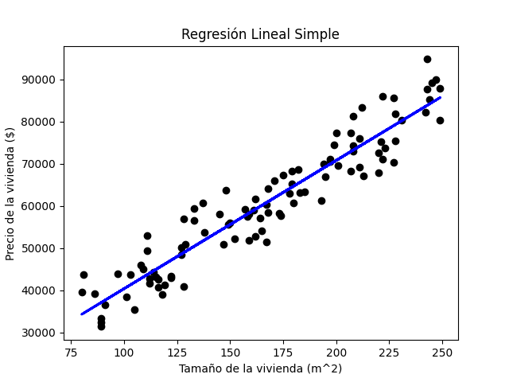

# Importacion de Librerías

- **NumPy**: proporciona soporte para arreglos multidimensionales y operaciones matemáticas de alto nivel.

- **scikit-learn**: ofrece una variedad de herramientas y algoritmos para realizar tareas de minería y análisis de datos. Incluye algoritmos de aprendizaje automático, herramientas para preparación de datos, selección de modelos y evaluación de modelos.

- **Matplotlib**: permite crear una amplia gama de gráficos y visualizaciones, incluidos gráficos de líneas, gráficos de dispersión, histogramas, etc.

# Generación de Datos de Entrenamiento

- **tamaño_vivienda**: representa la variable independiente.

- **precio_vivienda**: representa la variable dependiente.

- **np.random.seed(0)**: establece la semilla para el generador de números aleatorios de NumPy en 

- **np.random.randint(80, 250, num_datos).reshape(-1, 1)**: genera números aleatorios enteros entre 80 y 250 y establece una matriz de una columna y tantas filas como datos.

- **np.random.normal(0, 5000, (num_datos, 1))**: agrega ruido aleatorio a los precios calculados.

# Creación y Entrenamiento del Modelo

- **Crear un modelo de regresión lineal**: se instancia un objeto de la clase `LinearRegression()`. Se crea un modelo vacío que luego será entrenado con los datos proporcionados.

- **Entrenar el modelo con los datos**: se utiliza el método `.fit()` para entrenar al modelo con los datos de entrenamiento (`tamaño_vivienda` y `precio_vivienda`).

# Cálculo de Coeficiente de Regresión y Término Independiente

- **Coeficiente de regresión**: es la pendiente de la línea de regresión en un modelo de regresión lineal. Indica cuánto cambia la variable dependiente por cada unidad de cambio en la variable independiente.

- **Término independiente**: es el valor de la variable dependiente cuando todas las variables independientes son cero. En un modelo de regresión lineal simple, es el valor inicial de la función de regresión.

# Predicción del Precio de una Vivienda

- Se utiliza el método `predict()` del modelo para predecir el precio de la nueva vivienda basado en su tamaño, el cuál es de 160 metros cuadrados (m^2).

# Cálculo del Error Cuadrático Medio (MSE) y Coeficiente de Determinación (R^2)

- **modelo.predict(tamaño_vivienda)**: se utiliza el modelo de regresión lineal entrenado para predecir los precios de las viviendas en función de sus tamaños.

- **mean_squared_error()**: se calcula el "El Error Cuadrático Medio" (MSE) que es una medida de la calidad de un modelo de regresión. Calcula la media de los errores al cuadrado entre las predicciones del modelo y los valores reales. Cuanto menor sea el valor del MSE, mejor será el ajuste del modelo a los datos.

- **r2_score**: se calcila el "Coeficiente de Determinación" (R^2) es una medida que indica cuánta variabilidad en la variable dependiente puede ser explicada por el modelo. R^2 varía entre 0 y 1.

- - Un valor de 1 indica un ajuste perfecto del modelo a los datos, todas las variaciones en la variable dependiente son explicadas por las variables independientes.

- - Un valor de 0 indica que el modelo no explica ninguna variación en la variable dependiente

# Código Gráfico

- **plt.scatter()**: se crea un gráfico de dispersión donde cada punto representa una observación en los datos de entrenamiento. El eje x representa el tamaño de la vivienda (variable independiente) y el eje y representa el precio de la vivienda (variable dependiente).

- **plt.plot()**: se traza la línea de regresión generada por el modelo de regresión lineal. Utiliza el método predict() del modelo para obtener las predicciones del precio de la vivienda para cada tamaño de vivienda.

# Visualización de la Regresión Linear

- **Puntos Negros**: representan los datos de entrenamiento utilizados en el modelo de regresión. El eje x de cada uno representa su tamaño en m^2 (variable independiente) y el eje y representa su precio (variable dependiente) en $.

- **Linea Azul**: representa la línea de regresión lineal. Está basada en los datos de entrenamiento del modelo de regresión lineal y representa la mejor estimación en la relación lineal entre el tamaño de las viviendas (variable independiente) y el precio de las viviendas (variable dependiente)

- **Interpretación del Ajuste del Modelo**: la linea de regresión pasa bastante cerca de la mayoría de los puntos, esto podría reflejar que el modelo tiene un ajuste razonable a los datos. Sin embargo, si bien el R^2 se encuentra cercano a 1 (0,8991246) indicando que es un buen modelo, el MSE se encuentra alto y lejano a 0 (23538792.3324).
